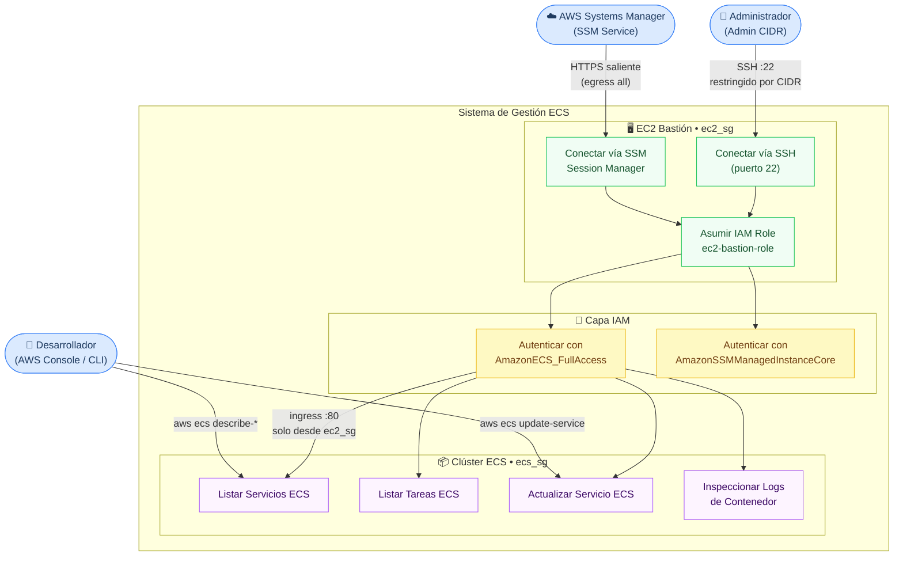

# Diagrama de Caso de Uso — Bastión EC2 / Clúster ECS



## Actores

| Actor | Rol |
|---|---|
| **Administrador** | Accede al bastión vía SSH desde un CIDR corporativo restringido |
| **AWS SSM Service** | Establece sesiones seguras sin necesidad de puerto 22 expuesto |
| **Desarrollador** | Interactúa con ECS directamente via AWS CLI / Console usando el bastión como proxy de red |

## Casos de Uso

| ID | Caso de Uso | Actor Principal | Precondición |
|---|---|---|---|
| UC1 | Conectar vía SSH | Administrador | IP en `allowed_ssh_cidr` |
| UC2 | Conectar vía SSM Session Manager | SSM Service | Instancia registrada en SSM |
| UC3 | Asumir IAM Role | EC2 Bastión | Instance Profile asociado |
| UC4 | Autenticar con ECS Full Access | IAM Role | `AmazonECS_FullAccess` adjunta |
| UC5 | Autenticar con SSM Core | IAM Role | `AmazonSSMManagedInstanceCore` adjunta |
| UC6 | Listar Servicios ECS | Bastión / Dev | Ingress :80 permitido por `ecs_sg` |
| UC7 | Listar Tareas ECS | Bastión / Dev | Igual que UC6 |
| UC8 | Actualizar Servicio ECS | Bastión / Dev | Igual que UC6 |
| UC9 | Inspeccionar Logs de Contenedor | Bastión | Igual que UC6 |
```
